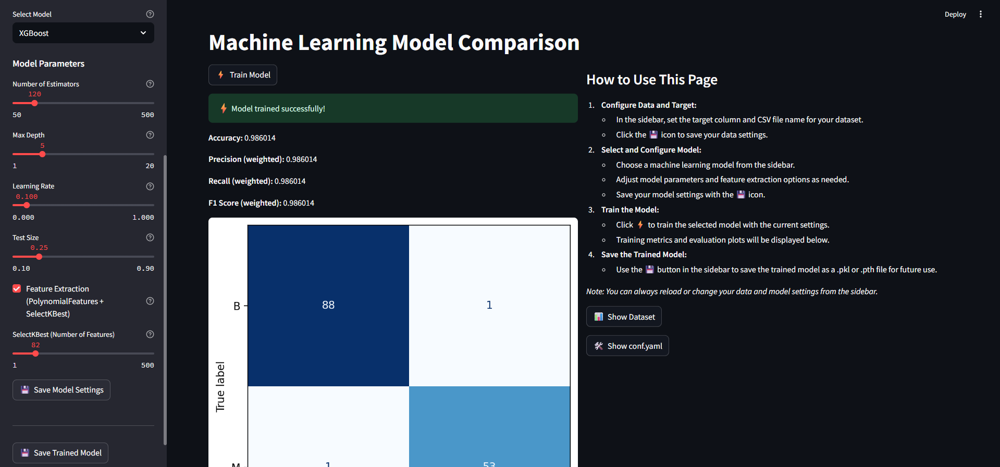

# Breast Cancer Wisconsin ML Project

## Installation

1. Clone the repository:
   ```bash
   git clone https://github.com/yourusername/breast-cancer-wisconsin.git
   cd breast-cancer-wisconsin
   ```
2. (Recommended) Create and activate a virtual environment:
   ```bash
   python -m venv .venv
   source .venv/bin/activate  # On Windows: .venv\Scripts\activate
   ```
3. Install dependencies:
   ```bash
   pip install -r requirements.txt
   ```
   Or with uv:
   ```bash
   uv sync
   ```

## Usage - Local

1. Run the Streamlit app locally:
   ```bash
   streamlit run main.py
   ```

## Usage - Docker

1. Build the Docker image:
   ```bash
   docker build -t breast-cancer-app .
   ```
2. Run the Docker container:
   ```bash
   docker run -p 8080:8080 breast-cancer-app
   ```
3. Access the app in your browser at [http://localhost:8080](http://localhost:8080)

## What Can You Do with this Streamlit App?

With the Streamlit interface in this project, you can easily perform the following tasks:

- **Data Upload and Exploration:**
  - Select your own data file (CSV) and specify the target column.
  - View the uploaded dataset as a table.
  - View and update the settings in the `conf.yaml` file directly from the interface.

- **Model Selection and Parameter Tuning:**
  - Choose from SVM, CatBoost, XGBoost, Random Forest, Logistic Regression, or a custom PyTorch MLP (TorchMLP) model.
  - Dynamically adjust hyperparameters (e.g., number of layers, learning rate, number of trees, etc.) for the selected model via the interface.
  - Save your model and data settings.

- **Model Training and Evaluation:**
  - Train the selected model with a single click and instantly view training and test results (accuracy, F1, etc.).
  - Any errors or warnings during training are displayed in a user-friendly way.

  
- **Model Saving:**
  - Save your trained model (in .pkl or .pth format).

- **User-Friendly and Flexible:**
  - All settings and actions can be performed easily from the interface—no coding required.
  - Clear error messages are shown for invalid settings or data loading issues.

---

#### Note on Streamlit + PyTorch Warning

You may see a warning like the following when running the app with Streamlit and PyTorch:

```
RuntimeError: Tried to instantiate class '__path__._path', but it does not exist! Ensure that it is registered via torch::class_
```

This warning is caused by an incompatibility between Streamlit's file watcher and PyTorch's dynamic class loading. It does **not** affect model training or inference, and can be safely ignored. Your application will continue to work as expected.

---

## App Screenshot

Below is a example screenshot of the Streamlit app interface:

